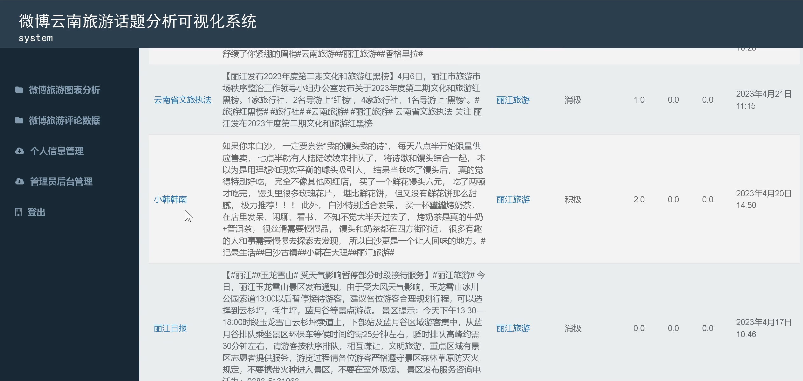
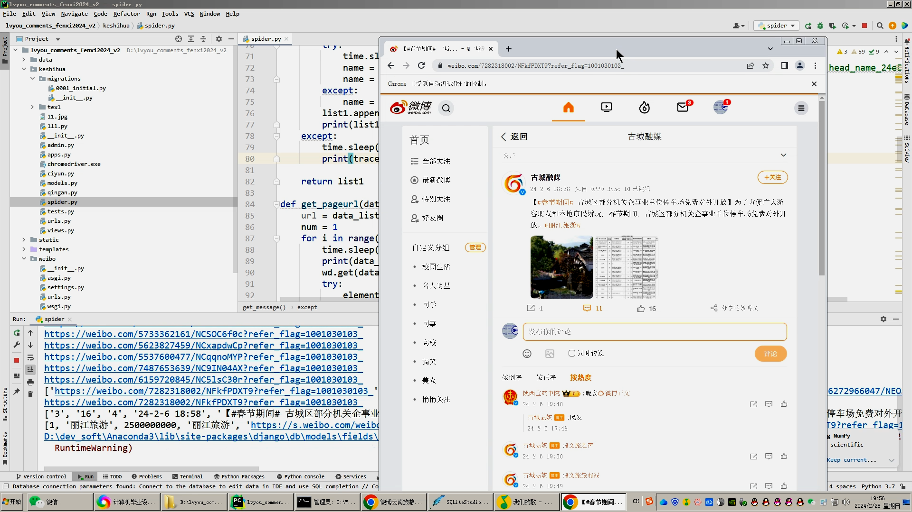

## 计算机毕业设计精品Python+Django旅游景点评论情感分析 NLP情感分析 LDA主题分析 bayes分类 旅游爬虫 旅游景点评论爬虫 机器学习 深度学习 旅游推荐系统

## 要求
### 源码有偿！一套(论文 PPT 源码+sql脚本+教程)

### 
### 加好友前帮忙start一下，并备注github有偿纯python旅游情感分析
### 我的QQ号是2827724252或者798059319或者 1679232425或者微信:bysj2023nb 或bysj1688

# 

### 加qq好友说明（被部分 网友整得心力交瘁）：
    1.加好友务必按照格式备注
    2.避免浪费各自的时间！
    3.当“客服”不容易，repo 主是体面人，不爆粗，性格好，文明人。
	
	

## 演示视频
https://www.bilibili.com/video/BV11F4m1j7LD/
https://www.bilibili.com/video/BV1SK421t72A/
https://www.bilibili.com/video/BV1UR2MYcEQj/

## 技术栈：django、mysql、scikit-learn、深度学习等
## 创新点：机器学习、推荐算法、可视化分析

## 演示截图

